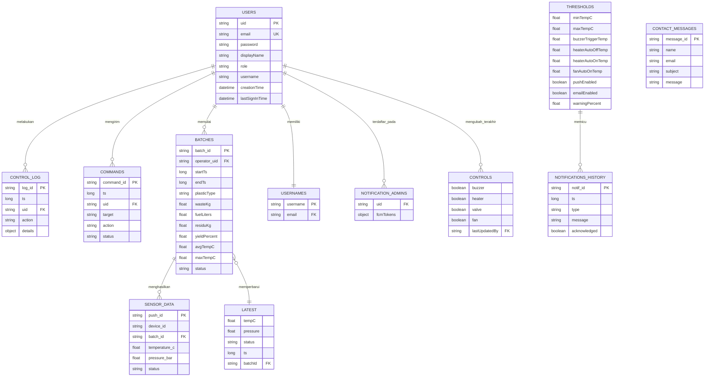
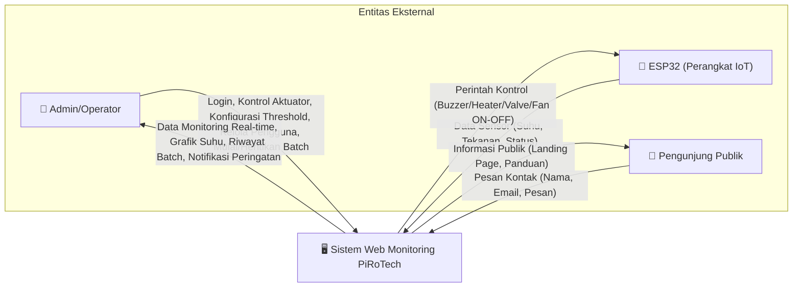
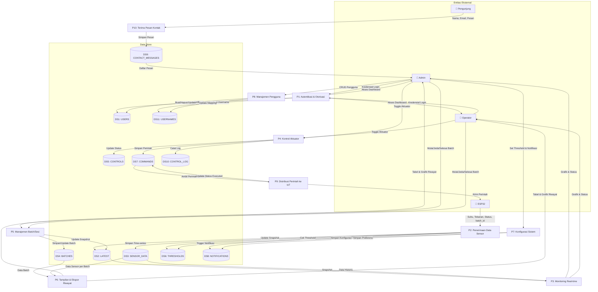

# Dokumen Analisis Struktural — Sistem Web Monitoring PiRoTech

> **Catatan versi**: Dokumen ini adalah **revisi total** dari `dokumen_pendukung_erd_dfd.docx`. Perbaikan yang dilakukan: (1) menambahkan Analisa Permasalahan yang sebelumnya belum ada, (2) merapikan Analisa Kebutuhan Alat sesuai format yang diminta, (3) menghapus duplikasi entitas, (4) menyatakan dengan jelas bahwa diagram di sini menggambarkan **rancangan sistem target (to-be)**, bukan sekadar kondisi database saat ini, dan (5) memperbaiki dua pelanggaran kaidah DFD (aliran data langsung antara entitas eksternal dan data store tanpa melalui proses).

---

## 1. Analisa Pembuatan Project

### 1.1 Analisa Permasalahan

Sampah plastik merupakan salah satu permasalahan lingkungan yang signifikan, karena sifatnya yang sulit terurai secara alami dan jumlahnya yang terus meningkat seiring pertumbuhan konsumsi. Salah satu solusi untuk mengurangi volume sampah plastik sekaligus memberikan nilai tambah ekonomis adalah dengan mengubahnya menjadi bahan bakar cair melalui proses **pirolisis** — pemanasan plastik tanpa oksigen pada suhu tinggi sehingga terurai menjadi senyawa hidrokarbon cair.

Namun, proses pirolisis konvensional memiliki beberapa permasalahan operasional:

1. **Pemantauan suhu dan tekanan reaktor masih dilakukan secara manual**, sehingga operator harus terus-menerus berada di dekat alat untuk mengawasi kondisi proses. Ini tidak efisien dari sisi waktu dan berisiko terhadap keselamatan kerja, mengingat proses pirolisis melibatkan suhu tinggi (bisa mencapai ratusan derajat Celsius) yang berpotensi menimbulkan bahaya jika tidak terkontrol (overheat, tekanan berlebih).
2. **Tidak ada mekanisme keamanan otomatis** — jika suhu naik melewati batas aman, tidak ada tindakan otomatis (seperti alarm atau mematikan pemanas) tanpa campur tangan manual, yang bisa terlambat jika operator sedang lengah.
3. **Pencatatan hasil tiap batch proses (berat sampah, jenis plastik, hasil BBM, durasi, dsb.) masih dilakukan manual**, sehingga rawan human error, sulit dianalisis tren-nya dari waktu ke waktu, dan tidak tersedia secara real-time bagi pihak yang ingin memantau dari jarak jauh.
4. **Tidak ada sistem terpusat** yang menghubungkan data sensor dari alat dengan antarmuka yang mudah diakses oleh operator maupun pihak pengelola (misal dosen pembimbing/pengelola workshop), sehingga evaluasi kinerja alat menjadi lebih sulit dilakukan.

Berdasarkan permasalahan tersebut, dibutuhkan sebuah **sistem embedded (IoT) yang terintegrasi dengan aplikasi web monitoring**, yang mampu:
- Membaca data sensor suhu dan tekanan reaktor secara real-time.
- Menampilkan data tersebut pada dashboard yang dapat diakses jarak jauh.
- Memberikan peringatan otomatis (alarm/notifikasi) saat kondisi mendekati atau melewati batas aman.
- Mengizinkan kontrol jarak jauh terhadap aktuator (pemanas, katup, kipas, buzzer) oleh operator yang berwenang.
- Mencatat riwayat setiap batch proses secara otomatis untuk keperluan evaluasi dan pelaporan.

### 1.2 Analisa Kebutuhan Alat

#### a. Kebutuhan Perangkat Lunak (Software)

| No | Software | Kegunaan |
|---|---|---|
| 1 | **Next.js (React + TypeScript)** | Framework untuk membangun antarmuka web (frontend) monitoring dan halaman publik, sekaligus menyediakan API Routes untuk logika backend (server-side) |
| 2 | **Tailwind CSS** | Framework styling untuk membangun tampilan antarmuka secara cepat dan konsisten |
| 3 | **Firebase Realtime Database (RTDB)** | Database NoSQL berbasis cloud untuk menyimpan data sensor, log aktivitas, kontrol, dan data pengguna secara real-time |
| 4 | **Firebase Authentication** | Mengelola proses login, autentikasi, dan otorisasi peran pengguna (admin/operator) |
| 5 | **Firebase Cloud Functions** | Menjalankan logika otomatis di sisi server tanpa server terpisah (contoh: mengirim notifikasi saat batch baru dimulai) |
| 6 | **Firebase Cloud Messaging (FCM)** | Mengirim push notification ke perangkat admin saat terjadi kondisi tertentu (misal: batch dimulai, suhu melewati ambang batas) |
| 7 | **Arduino IDE / PlatformIO** | Lingkungan pengembangan untuk menulis dan meng-upload firmware ke mikrokontroler ESP32 |
| 8 | **Vercel** | Platform hosting untuk mendeploy aplikasi web (public & monitoring) agar dapat diakses secara online |
| 9 | **Visual Studio Code (atau editor sejenis)** | Alat bantu pengembangan (menulis, menguji, dan mengelola source code) |
| 10 | **Git & GitHub** | Version control untuk mengelola perubahan source code secara kolaboratif dalam tim |

#### b. Kebutuhan Perangkat Keras (Hardware)

| No | Hardware | Kegunaan |
|---|---|---|
| 1 | **ESP32 (Mikrokontroler)** | Otak dari sistem embedded — membaca data dari sensor, mengirimkannya ke Firebase, serta menerima dan mengeksekusi perintah kontrol aktuator. Dipilih karena memiliki modul WiFi terintegrasi |
| 2 | **Sensor Suhu (Thermocouple tipe K + modul amplifier, misal MAX6675/MAX31855)** | Mengukur suhu reaktor pirolisis yang bisa mencapai ratusan derajat Celsius (sensor suhu biasa seperti DS18B20 tidak cukup tahan panas untuk kebutuhan ini) |
| 3 | **Sensor Tekanan** | Memantau tekanan di dalam reaktor untuk mendeteksi potensi tekanan berlebih yang berbahaya |
| 4 | **Modul Relay** | Menjadi saklar elektronik yang memungkinkan ESP32 (sinyal tegangan rendah) mengendalikan perangkat bertegangan tinggi seperti heater, valve, dan fan |
| 5 | **Heater (Elemen Pemanas)** | Memanaskan reaktor untuk memulai proses pirolisis |
| 6 | **Valve (Katup, solenoid/motorized)** | Mengatur aliran gas/uap hasil pirolisis menuju kondensor |
| 7 | **Fan/Blower** | Membantu proses pendinginan (cooling) reaktor setelah proses selesai, atau mendukung sirkulasi udara pembakaran |
| 8 | **Buzzer** | Alarm suara sebagai peringatan lokal saat kondisi tidak aman terdeteksi |
| 9 | **Power Supply/Adaptor** | Menyediakan daya listrik yang stabil untuk ESP32 dan komponen elektronik pendukung |
| 10 | **Kabel Jumper & Breadboard/PCB** | Menghubungkan seluruh komponen elektronik menjadi satu rangkaian yang berfungsi |
| 11 | **Enclosure/Casing** | Melindungi komponen elektronik dari panas, debu, dan kelembapan di lingkungan kerja alat pirolisis |

---

## 2. Gambaran Umum Sistem

### 2.1 Deskripsi Sistem

**Web Monitoring PiRoTech** adalah sistem berbasis web untuk memantau dan mengendalikan alat pirolisis plastik secara real-time. Sistem ini mengubah sampah plastik menjadi bahan bakar cair (BBM) melalui proses pirolisis, dan menyediakan dashboard monitoring suhu, tekanan, kontrol aktuator (buzzer, heater, valve, fan), serta pencatatan log aktivitas pengolahan.

### 2.2 Status Diagram: Rancangan Target (To-Be)

> ⚠️ **Penting**: ERD dan DFD dalam dokumen ini menggambarkan **rancangan sistem yang dituju (to-be)** sebagai hasil Fase Analisis, bukan cuma potret struktur database yang sudah berjalan hari ini. Beberapa entitas (misal `BATCHES`, `THRESHOLDS` gabungan) merupakan penyempurnaan dari struktur data yang saat ini masih tersebar dan tumpang tindih di implementasi awal. Ini wajar dalam siklus pengembangan perangkat lunak — Fase Analisis bertugas merancang struktur yang *seharusnya*, yang kemudian menjadi acuan implementasi.

### 2.3 Aktor/Pengguna Sistem

| Aktor | Deskripsi | Hak Akses |
|---|---|---|
| **Admin** | Pengelola utama sistem, dapat mengakses semua fitur | CRUD penuh pada semua data, kelola pengguna |
| **Operator** | Pengguna operasional yang mengoperasikan alat | Monitoring, kontrol proses, lihat log |
| **Perangkat IoT (ESP32)** | Mikrokontroler yang mengirim data sensor | Write sensor data, read commands |
| **Pengunjung (Public)** | Pengunjung website publik | Lihat landing page, panduan, hubungi kami |

---

## 3. Struktur Data (Entitas) — Sudah Disederhanakan

> Struktur berikut adalah hasil **konsolidasi** dari struktur lama yang memiliki banyak entitas tumpang tindih. Perubahan yang dilakukan dijelaskan di tabel "Riwayat Penyederhanaan" di bagian akhir bab ini.

### 3.1 ENTITAS: `USERS`

| Atribut | Tipe Data | Keterangan | Constraint |
|---|---|---|---|
| uid | String | ID unik pengguna | Primary Key, auto-generated |
| email | String | Alamat email | Unique, Required |
| password | String | Password (hashed oleh Firebase Auth) | Required, min 6 karakter |
| displayName | String | Nama tampilan | Optional |
| role | String (enum) | Peran: admin / operator | Stored as Custom Claim |
| username | String | Username login alternatif | Unique, no spaces, Optional |
| creationTime | String (ISO) | Waktu pembuatan akun | Auto-generated |
| lastSignInTime | String (ISO) | Waktu login terakhir | Auto-updated |

### 3.2 ENTITAS: `USERNAMES`

Mapping username → email untuk fitur login via username.

| Atribut | Tipe Data | Keterangan | Constraint |
|---|---|---|---|
| username (key) | String | Username (lowercase) | Primary Key, Unique |
| email | String | Email terkait | FK → USERS.email |

### 3.3 ENTITAS: `LATEST` *(gabungan dari `monitoring` + `pirotech/latest` + `pirotech/readings` + `pirotech/telemetry`)*

Snapshot data sensor terkini yang ditimpa (overwrite) setiap kali ESP32 mengirim data baru. Dipakai untuk tampilan live dashboard.

| Atribut | Tipe Data | Keterangan | Constraint |
|---|---|---|---|
| tempC | Number (float) | Suhu reaktor saat ini (°C) | Required |
| pressure | Number (float) | Tekanan reaktor saat ini | Required |
| status | String (enum) | IDLE / HEATING / PYROLYSIS / COOLING | Required |
| ts | Number (long) | Timestamp pembacaan terakhir (epoch ms) | Required |
| batchId | String | ID batch yang sedang berjalan | Optional, FK → BATCHES |

### 3.4 ENTITAS: `SENSOR_DATA`

Data historis time-series dari sensor. Key = Firebase Push ID (mengandung timestamp implisit).

| Atribut | Tipe Data | Keterangan | Constraint |
|---|---|---|---|
| push_id (key) | String | ID unik (Firebase Push Key) | Primary Key |
| device_id | String | ID perangkat ESP32 | Required |
| batch_id | String | ID batch terkait pembacaan ini | Required, FK → BATCHES |
| temperature_c | Number (float) | Suhu dalam Celsius | Required |
| pressure_bar | Number (float) | Tekanan dalam bar | Optional |
| status | String | Status proses saat pembacaan | Required |

> **Catatan perbaikan**: field `batch_id` ditambahkan di sini (sebelumnya tidak ada) sebagai kunci penghubung eksplisit ke `BATCHES` — ini memperbaiki kelemahan yang sempat ditemukan sebelumnya, di mana data sensor dan data batch cuma bisa dicocokkan lewat rentang waktu (kurang presisi).

### 3.5 ENTITAS: `BATCHES` *(gabungan dari `log_activity` + `pirotech/batches`)*

Setiap sesi pengolahan pirolisis, dari mulai hingga selesai beserta hasil kalkulasinya.

| Atribut | Tipe Data | Keterangan | Constraint |
|---|---|---|---|
| batch_id (key) | String | ID batch (push key) | Primary Key |
| operator_uid | String | UID user yang memulai batch | FK → USERS.uid |
| startTs | Number (long) | Timestamp mulai proses (epoch ms) | Required |
| endTs | Number (long) | Timestamp selesai proses | Optional (null jika masih berjalan) |
| plasticType | String | Jenis plastik: 1/2/4/5/6/mix | Required |
| wasteKg | Number (float) | Berat sampah plastik (kg) | Required |
| fuelLiters | Number (float) | Hasil BBM (liter) | Optional (diisi saat selesai) |
| residuKg | Number (float) | Berat residu/sisa (kg) | Optional |
| yieldPercent | Number (float) | Persentase yield | Optional |
| avgTempC | Number (float) | Rata-rata suhu selama proses | Optional (dihitung saat selesai) |
| maxTempC | Number (float) | Suhu maksimum selama proses | Optional |
| status | String (enum) | running / paused / completed / aborted | Required |

### 3.6 ENTITAS: `CONTROLS` *(gabungan dari `control` + `pirotech/controls`)*

Status kontrol aktuator terkini.

| Atribut | Tipe Data | Keterangan | Constraint |
|---|---|---|---|
| buzzer | Boolean | Status buzzer (true=ON) | Required |
| heater | Boolean | Status heater | Required |
| valve | Boolean | Status valve | Required |
| fan | Boolean | Status fan | Required |
| lastUpdatedBy | String | UID user yang terakhir mengubah | FK → USERS.uid |

### 3.7 ENTITAS: `CONTROL_LOG`

Audit trail setiap perubahan kontrol. *(Tetap dipertahankan sebagai entitas terpisah dari `CONTROLS` — ini bukan duplikasi, karena secara konsep "status terkini" dan "riwayat perubahan" adalah dua hal berbeda yang keduanya diperlukan.)*

| Atribut | Tipe Data | Keterangan | Constraint |
|---|---|---|---|
| log_id (key) | String | ID log (push key) | Primary Key |
| ts | Number (long) | Timestamp aksi (epoch ms) | Required |
| uid | String | UID user yang melakukan aksi | FK → USERS.uid |
| action | String | Jenis aksi | Required |
| details | Object | Detail perubahan (key-value) | Required |

### 3.8 ENTITAS: `COMMANDS`

Antrean perintah dari web ke ESP32.

| Atribut | Tipe Data | Keterangan | Constraint |
|---|---|---|---|
| command_id (key) | String | ID perintah (push key) | Primary Key |
| ts | Number (long) | Timestamp perintah | Required |
| uid | String | UID user pengirim | FK → USERS.uid |
| target | String | Target aktuator: buzzer/heater/valve/fan | Required |
| action | String | Aksi: ON / OFF | Required |
| status | String (enum) | pending / executed / failed | Required |

### 3.9 ENTITAS: `THRESHOLDS` *(gabungan dari `pirotech/thresholds` + `config` + `settings`)*

Konfigurasi ambang batas dan preferensi notifikasi.

| Atribut | Tipe Data | Keterangan | Constraint |
|---|---|---|---|
| minTempC | Number (float) | Suhu minimum aman | Required |
| maxTempC | Number (float) | Suhu maksimum aman | Required |
| buzzerTriggerTemp | Number (float) | Suhu pemicu buzzer otomatis | Required |
| heaterAutoOffTemp | Number (float) | Suhu heater mati otomatis | Required |
| heaterAutoOnTemp | Number (float) | Suhu heater nyala otomatis | Required |
| fanAutoOnTemp | Number (float) | Suhu fan nyala otomatis | Required |
| pushEnabled | Boolean | Notifikasi push aktif/tidak | Required |
| emailEnabled | Boolean | Notifikasi email aktif/tidak | Required |
| warningPercent | Number | Persentase ambang peringatan dini | Required |

### 3.10 ENTITAS: `NOTIFICATIONS_HISTORY`

| Atribut | Tipe Data | Keterangan | Constraint |
|---|---|---|---|
| notif_id (key) | String | ID notifikasi (push key) | Primary Key |
| ts | Number (long) | Timestamp notifikasi | Required |
| type | String (enum) | warning / critical | Required |
| message | String | Isi pesan notifikasi | Required |
| acknowledged | Boolean | Sudah dibaca atau belum | Default: false |

### 3.11 ENTITAS: `NOTIFICATION_ADMINS`

| Atribut | Tipe Data | Keterangan | Constraint |
|---|---|---|---|
| uid (key) | String | UID admin | FK → USERS.uid |
| fcmTokens | Object | Token FCM untuk push notification | Required |

### 3.12 ENTITAS: `CONTACT_MESSAGES`

Pesan dari form "Hubungi Kami" di halaman publik.

| Atribut | Tipe Data | Keterangan | Constraint |
|---|---|---|---|
| message_id (key) | String | ID pesan | Primary Key |
| name | String | Nama pengirim | Required |
| email | String | Email pengirim | Required |
| subject | String | Subjek pesan | Optional |
| message | String | Isi pesan | Required |

### 3.13 Data Referensi: Jenis Plastik (Konstanta, tidak disimpan di database)

| ID | Nama | Min Yield | Max Yield |
|---|---|---|---|
| 1 | PET (Botol Minum) | 30% | 40% |
| 2 | HDPE (Botol Susu, Galon) | 55% | 65% |
| 4 | LDPE (Kantong Plastik) | 50% | 60% |
| 5 | PP (Tutup Botol, Kemasan Makanan) | 50% | 60% |
| 6 | PS (Styrofoam) | 60% | 70% |
| mix | Campuran | 40% | 55% |

### 3.14 Riwayat Penyederhanaan Entitas (Perubahan dari Dokumen Lama)

| Entitas Lama (tumpang tindih) | Menjadi | Alasan |
|---|---|---|
| `monitoring`, `pirotech/latest`, `pirotech/readings`, `pirotech/telemetry` | **`LATEST`** | Keempatnya sama-sama merepresentasikan "snapshot data sensor terkini" — digabung jadi satu entitas |
| `log_activity`, `pirotech/batches` | **`BATCHES`** | Relasi 1:1 antar keduanya menandakan seharusnya satu entitas, bukan dua |
| `control`, `pirotech/controls` | **`CONTROLS`** | Sama-sama menyimpan status aktuator terkini |
| `pirotech/thresholds`, `config`, `settings` | **`THRESHOLDS`** | Sama-sama menyimpan ambang batas & preferensi sistem |
| `pirotech/events`, `pirotech/maintenance`, `pirotech/sessions` | *(dihapus dari cakupan)* | Tidak ada detail atribut yang jelas di dokumen sebelumnya — di luar cakupan analisis saat ini, bisa dirancang terpisah kalau fiturnya sudah lebih jelas |

Total entitas final: **12** (dari sebelumnya 15+ dengan banyak duplikasi).

---

## 4. ERD (Entity Relationship Diagram)



---

## 5. DFD (Data Flow Diagram)

### 5.1 DFD Level 0 — Diagram Konteks



### 5.2 DFD Level 1 — Proses Utama

> **Perbaikan dari versi sebelumnya**: ditambahkan **P9 (Distribusi Perintah ke IoT)** dan **P10 (Terima Pesan Kontak)** — pada versi lama, data mengalir langsung dari data store ke entitas eksternal (`DS Commands → ESP32`) dan dari entitas eksternal langsung ke data store (`Public → DS Contact Messages`) tanpa melalui proses, yang melanggar kaidah dasar DFD (semua aliran data ke/dari data store wajib melalui sebuah proses).



### 5.3 Penjelasan Detail Tiap Proses (Narasi Pendukung)

> Bagian ini adalah **penjelasan naratif** untuk memperjelas isi tiap proses pada DFD Level 1 — bukan diagram DFD Level 2 formal, melainkan tabel pendukung yang menjelaskan sub-langkah di dalam tiap proses.

**P1: Autentikasi & Otorisasi**
1. User memasukkan email/username + password.
2. Jika input bukan format email, sistem melakukan lookup ke `USERNAMES` untuk mendapatkan email terkait.
3. Firebase Auth memverifikasi email + password.
4. Token JWT diterima, custom claims (role, username) diparse.
5. Jika role valid, user diarahkan ke dashboard; jika tidak, kembali ke halaman login.

**P2: Penerimaan Data Sensor**
1. ESP32 mengirim data suhu, tekanan, status, dan `batch_id` aktif.
2. Data disimpan sebagai snapshot terbaru ke `LATEST`.
3. Data yang sama juga disimpan sebagai record baru ke `SENSOR_DATA` (time-series).
4. Sistem membandingkan suhu terkini dengan `THRESHOLDS`.
5. Jika melewati ambang batas, sistem mencatat notifikasi baru ke `NOTIFICATIONS_HISTORY`.

**P3: Monitoring Real-time**
1. Dashboard berlangganan (listener) perubahan data di `LATEST` untuk tampilan langsung.
2. Saat melihat riwayat satu batch, sistem mengambil data dari `SENSOR_DATA` yang difilter berdasarkan `batch_id`.
3. Data ditampilkan sebagai grafik suhu/tekanan.

**P4: Kontrol Aktuator**
1. Admin/Operator menekan tombol kontrol (toggle) di dashboard.
2. Sistem memperbarui status di `CONTROLS`.
3. Sistem menambahkan perintah baru ke antrean `COMMANDS` dengan status `pending`.
4. Sistem mencatat aksi ini ke `CONTROL_LOG` sebagai audit trail.

**P5: Manajemen Batch/Sesi**
1. Admin/Operator memulai batch baru dengan input berat sampah dan jenis plastik.
2. Sistem membuat record baru di `BATCHES` dengan status `running`, dan memperbarui `batchId` aktif di `LATEST`.
3. Selama proses berjalan, batch bisa dijeda/dilanjutkan (`status` berubah).
4. Saat batch diselesaikan, sistem menghitung hasil (BBM, residu, yield) berdasarkan rumus kalkulasi dan menyimpannya ke record `BATCHES` yang sama.

**Rumus Kalkulasi (dipakai di P5):**
```
Fuel Weight (kg)   = Weight Input × Avg Yield Rate (berdasarkan jenis plastik)
Fuel Volume (L)    = Fuel Weight / Avg Density BBM (0.78–0.85 kg/L)
Residue (kg)       = Weight Input × 10% (simplifikasi)
Economic Value     = Fuel Volume × Rp 6.800/L
Emisi yang Dicegah = Weight Input × 2.9 kg CO₂/kg
```

**P6: Tampilan & Ekspor Riwayat**
1. Sistem menampilkan daftar seluruh `BATCHES` yang sudah/sedang berjalan.
2. User dapat memilih satu batch untuk melihat detail beserta grafik `SENSOR_DATA` terkait.
3. User dapat mengekspor data mentah (`SENSOR_DATA`) ke format CSV.

**P7: Konfigurasi Sistem**
1. Admin mengatur ambang batas suhu/tekanan dan preferensi notifikasi.
2. Sistem menyimpan perubahan ke `THRESHOLDS`.

**P8: Manajemen Pengguna** *(Admin Only)*
1. Admin dapat melihat daftar, membuat, mengubah role/username, atau menghapus pengguna.
2. Perubahan disimpan ke `USERS` (Firebase Auth + custom claims) dan `USERNAMES`.

**P9: Distribusi Perintah ke IoT**
1. ESP32 secara berkala membaca `COMMANDS` dengan status `pending`.
2. Setelah perintah dieksekusi di alat, status diperbarui menjadi `executed`.

**P10: Terima Pesan Kontak**
1. Pengunjung mengisi form "Hubungi Kami" di halaman publik.
2. Sistem memvalidasi input, lalu menyimpannya sebagai record baru ke `CONTACT_MESSAGES`.

---

## 6. Hak Akses (RBAC) per Entitas

| Entitas | Read | Write |
|---|---|---|
| USERS | 🔐 Authenticated | 👤 Own user + Admin |
| USERNAMES | ✅ Semua (untuk lookup login) | 👤 Admin |
| LATEST | ✅ Semua | 🔌 IoT Only |
| SENSOR_DATA | 🔐 Authenticated | 🔌 IoT Only |
| BATCHES | 🔐 Authenticated | 👤 Admin + Operator |
| CONTROLS | 🔐 Authenticated | 👤 Admin + Operator |
| CONTROL_LOG | 👤 Admin Only | 👤 Admin Only (via sistem) |
| COMMANDS | 🔐 Authenticated | 👤 Admin + Operator (create), 🔌 IoT (update status) |
| THRESHOLDS | ✅ Semua | 👤 Admin Only |
| NOTIFICATIONS_HISTORY | 👤 Admin Only | 👤 Admin Only (via sistem) |
| NOTIFICATION_ADMINS | 👤 Admin Only | 👤 Admin Only |
| CONTACT_MESSAGES | 👤 Admin Only | ✅ Semua (public form) |

---

## 7. API Routes (Endpoint Server)

| Method | Endpoint | Fungsi | Akses |
|---|---|---|---|
| GET | /api/users | Daftar semua pengguna | Admin |
| POST | /api/users | Buat pengguna baru | Admin |
| PATCH | /api/users/[uid] | Update role/username pengguna | Admin |
| DELETE | /api/users/[uid] | Hapus pengguna | Admin |
| GET | /api/auth/lookup?username=xxx | Lookup username → email | Public |
| GET | /api/batches/[batchId]/data | Ambil data sensor untuk satu batch | Authenticated |
| POST | /api/contact | Kirim pesan kontak | Public |

---

## 8. Cloud Functions (Firebase Functions)

| Fungsi | Trigger | Aksi |
|---|---|---|
| notifyBatchStart | onValueCreated("/BATCHES/{batchId}") saat status="running" | Kirim push notification ke semua admin saat batch baru dimulai |

---

## 9. Halaman Sistem

| Halaman | URL | Tipe | Deskripsi |
|---|---|---|---|
| Landing Page | / | Public | Halaman utama website |
| Panduan | /panduan | Public | Panduan penggunaan alat |
| Hubungi Kami | /hubungi | Public | Form kontak |
| Login | /login | Public | Halaman login |
| Dashboard | /dashboard | Auth | Monitoring real-time + grafik suhu |
| Overview | /overview | Auth | Ringkasan operasional + mulai proses |
| Riwayat Batch | /log-activity | Auth | Riwayat pengolahan |
| Pengaturan | /pengaturan | Auth | Konfigurasi threshold & notifikasi |
| Profil | /profil | Auth | Pengaturan akun + kelola pengguna (admin) |

---

## 10. Ringkasan Entitas untuk ERD

**12 Entitas Final:**
1. USERS
2. USERNAMES
3. LATEST
4. SENSOR_DATA
5. BATCHES
6. CONTROLS
7. CONTROL_LOG
8. COMMANDS
9. THRESHOLDS
10. NOTIFICATIONS_HISTORY
11. NOTIFICATION_ADMINS
12. CONTACT_MESSAGES

**Relasi Utama:**
- USERS **1:N** CONTROL_LOG (satu user bisa melakukan banyak aksi kontrol)
- USERS **1:N** COMMANDS (satu user bisa mengirim banyak perintah)
- USERS **1:N** BATCHES (satu user bisa memulai banyak batch)
- USERS **1:1** USERNAMES (satu user punya satu username)
- BATCHES **1:N** SENSOR_DATA (satu batch menghasilkan banyak data sensor)
- BATCHES **1:1** LATEST (batch aktif tercermin di snapshot terkini)
- THRESHOLDS **1:N** NOTIFICATIONS_HISTORY (threshold memicu notifikasi)

> **Catatan alat bantu**: Diagram Mermaid di atas dapat langsung dirender di GitHub, atau di-copy ke [mermaid.live](https://mermaid.live) untuk diekspor sebagai gambar, kemudian dirapikan lebih lanjut di **draw.io**, **Lucidchart**, **StarUML**, atau **Microsoft Visio** sesuai kebutuhan tugas.
