# 📄 Dokumen Rangkuman Sistem PiRoTech

**Proyek:** PiRoTech — Monitoring Alat Pengolah Sampah Plastik Menjadi Bahan Bakar Cair Menggunakan Teknologi Pirolisis Berbasis IoT  
**Institusi:** Sekolah Vokasi IPB  
**Tanggal:** 5 Agustus 2026

---

## 1. Gambaran Umum Sistem

PiRoTech adalah aplikasi web pemantauan (**monitoring**) dan pengendalian (**control**) proses pirolisis plastik secara real-time berbasis Internet of Things (IoT). Sistem ini menghubungkan perangkat keras sensor (mikrokontroler) pada reaktor pirolisis dengan dashboard web melalui Firebase Realtime Database, sehingga operator/admin dapat memantau suhu, status proses, dan durasi dari mana saja.

---

## 2. Tech Stack (Teknologi yang Digunakan)

### 2.1. Frontend (Web Application)

| Teknologi | Versi | Keterangan |
|---|---|---|
| **Next.js** | 15.5.3 | Framework React dengan App Router, Turbopack |
| **React** | 19.1.0 | Library UI utama |
| **TypeScript** | ^5 | Superset JavaScript untuk type-safety |
| **TailwindCSS** | ^3.4.17 | Utility-first CSS framework untuk styling |
| **Recharts** | ^3.2.1 | Library grafik/chart untuk visualisasi data time-series |
| **Lucide React** | ^0.544.0 | Icon library modern (pengganti Feather Icons) |
| **clsx** | ^2.1.1 | Utility untuk conditional CSS class names |
| **Next.js Image** | Built-in | Optimisasi gambar otomatis |

### 2.2. Backend & Database

| Teknologi | Keterangan |
|---|---|
| **Firebase Realtime Database (RTDB)** | Database utama NoSQL real-time untuk menyimpan dan streaming data sensor |
| **Firebase Authentication** | Autentikasi pengguna (email & password) dengan Custom Claims (role: admin/operator/guest) |
| **Firebase Cloud Functions (v2)** | Serverless function untuk notifikasi FCM saat batch dimulai |
| **Firebase Cloud Messaging (FCM)** | Push notification ke admin saat proses pirolisis dimulai |
| **Firebase Admin SDK** | ^13.5.0 — Digunakan di server-side / tools untuk set custom claims |

### 2.3. Development Tools

| Tool | Keterangan |
|---|---|
| **Turbopack** | Bundler cepat bawaan Next.js untuk dev mode |
| **ESLint** | Linter untuk kualitas kode |
| **PostCSS + Autoprefixer** | Preprocessor CSS untuk TailwindCSS |
| **node tools/set-admin.js** | Script CLI untuk set role admin via Firebase Admin SDK |

### 2.4. Branding & Palet Warna

```
--brand-green:    #4D8942  (utama / primary)
--brand-sage:     #687C63  (secondary / aksen)
--brand-green50:  #E9F3E7  (light green)
--brand-green700: #3E6E36  (dark green)
--brand-sage50:   #EEF2EF  (light sage)
--brand-tan:      #CFBB99  (aksen warm)
--brand-bone:     #E5D7C4  (aksen warm)
--app-bg:         #F1F5F0  (sage sangat lembut — background utama)
```

---

## 3. Struktur Direktori Proyek (Saat Ini)

```
pirotech1/
├── .env.local                    # Environment variables Firebase
├── .gitignore
├── functions/
│   └── index.js                  # Cloud Function: notifyBatchStart (FCM)
├── tools/
│   ├── service-account.json      # Firebase service account key
│   └── set-admin.js              # Script CLI set role admin
├── public/
│   ├── ilustrasi_pirotech.jpg    # Gambar hero landing page
│   ├── pirotechlogo.png          # Logo navbar
│   ├── pirotechlogo1.jpeg        # Logo alternatif
│   ├── skema_alat.png            # Diagram skematik alat
│   ├── logo.svg, logo1.png       # Logo lain
│   └── ... (SVG default Next.js)
├── src/
│   ├── app/
│   │   ├── globals.css           # Global styles & design tokens
│   │   ├── layout.tsx            # Root layout (Navbar + Footer)
│   │   ├── page.tsx              # Landing page / Beranda
│   │   ├── login/page.tsx        # Halaman login
│   │   ├── panduan/page.tsx      # Halaman panduan publik
│   │   ├── hubungi/page.tsx      # Halaman kontak / form "Hubungi Kami"
│   │   ├── dashboard/page.tsx    # Dashboard monitoring realtime
│   │   └── admin/
│   │       ├── layout.tsx        # Guard layout (redirect jika bukan admin)
│   │       ├── page.tsx          # Admin: konfigurasi ambang + notifikasi
│   │       ├── config/page.tsx   # Admin: konfigurasi ambang suhu & tekanan
│   │       ├── maintenance/page.tsx # Admin: form + tabel log maintenance
│   │       ├── riwayat/page.tsx  # Admin: riwayat data suhu (raw/1m/5m)
│   │       ├── inbox/page.tsx    # Admin: inbox pesan dari "Hubungi Kami"
│   │       └── users/            # (Kosong — belum diimplementasi)
│   ├── components/
│   │   ├── Navbar.tsx            # Navigasi atas (responsive, role-aware)
│   │   ├── RealtimeChart.tsx     # Grafik suhu real-time (Recharts)
│   │   ├── StatCard.tsx          # Kartu statistik (suhu, status, durasi)
│   │   ├── StatusBadge.tsx       # Badge status: IDLE / HEATING
│   │   ├── DurationClock.tsx     # Timer durasi proses (HH:MM:SS)
│   │   └── HistoryTable.tsx      # Tabel riwayat pembacaan + download CSV
│   ├── config/
│   │   └── thresholds.ts         # Ambang aman suhu (20–450°C) & tekanan (0–300kPa)
│   ├── lib/
│   │   ├── firebase.ts           # Inisialisasi Firebase app & RTDB
│   │   ├── types.ts              # Type definitions (Reading, LatestSnapshot, ProcessStatus)
│   │   ├── db.ts                 # Fungsi subscribe & write ke RTDB
│   │   ├── csv.ts                # Utility export data ke CSV
│   │   └── useRole.ts            # Custom hook: deteksi role user (admin/operator/guest)
│   └── firebase.rules.json       # Security rules RTDB
├── tailwind.config.js
├── tsconfig.json
├── next.config.ts
├── postcss.config.js
└── package.json
```

---

## 4. Fitur-Fitur Saat Ini

### 4.1. Halaman Publik (Tanpa Login)

| Halaman | Rute | Deskripsi |
|---|---|---|
| **Beranda** | `/` | Landing page: hero section, 3 keunggulan (Real-Time Monitoring, Kontrol Manual, Histori & Analitik), CTA, info kontak |
| **Panduan** | `/panduan` | Panduan penggunaan alat: jenis plastik yang aman, skema alat, cara pakai, FAQ |
| **Hubungi Kami** | `/hubungi` | Form kontak (nama, email, subjek, pesan) → disimpan ke Firebase `contact/messages` |
| **Login** | `/login` | Form login email + password → Firebase Auth |

### 4.2. Dashboard (Role: operator / admin)

| Fitur | Deskripsi |
|---|---|
| **Suhu Real-Time** | Menampilkan suhu terkini dari sensor (StatCard) |
| **Status Proses** | Badge IDLE/HEATING berdasarkan threshold suhu (≥40°C = HEATING) |
| **Durasi Batch** | Timer HH:MM:SS berjalan selama status HEATING |
| **Grafik Suhu** | Line chart real-time (Recharts) dengan kompresi per-menit |
| **Suhu Max** | Nilai suhu tertinggi dari window data |
| **Sampel Data** | Jumlah data point yang sedang ditampilkan |

### 4.3. Panel Admin (Role: admin only)

| Halaman | Rute | Deskripsi |
|---|---|---|
| **Konfigurasi Ambang** | `/admin` dan `/admin/config` | Atur ambang aman suhu (min/max °C) dan tekanan (min/max kPa) → simpan ke `/pirotech/config` di RTDB |
| **Preferensi Notifikasi** | `/admin` | Toggle email & FCM notification |
| **Maintenance** | `/admin/maintenance` | Form input log pemeliharaan (tanggal, item, tindakan, teknisi, biaya, catatan) + tabel + filter + export CSV |
| **Riwayat** | `/admin/riwayat` | Tabel riwayat data suhu dengan resolusi (Raw/1m/5m), analitik (ΔSuhu, Moving Average 10), ringkasan statistik, export CSV |
| **Inbox** | `/admin/inbox` | Daftar pesan masuk dari form "Hubungi Kami", bisa dihapus |

---

## 5. Struktur Data Firebase Realtime Database

```
pirotech/
├── latest/                       # Data terbaru dari sensor
│   ├── current/
│   │   ├── ts: number            # Timestamp (ms)
│   │   ├── tempC: number         # Suhu saat ini (°C)
│   │   └── status: string        # Status proses
│   ├── batchId: string           # ID batch aktif
│   └── startTs: number           # Timestamp mulai batch (trigger Cloud Function)
│
├── readings/                     # Riwayat seluruh pembacaan sensor
│   └── {pushId}/
│       ├── ts: number            # Timestamp (ms)
│       ├── tempC: number         # Suhu (°C)
│       ├── pressureKPa?: number  # Tekanan (opsional, tidak aktif)
│       ├── status?: string       # IDLE / HEATING / PYROLYSIS / COOLING
│       └── durationSec?: number  # Durasi proses (detik)
│
├── maintenance/                  # Log pemeliharaan alat
│   └── {pushId}/
│       ├── ts: number
│       ├── item: string          # "Heater" / "Valve" / "Sensor"
│       ├── action: string        # "Ganti sparepart"
│       ├── tech: string          # Nama teknisi
│       ├── notes?: string        # Catatan opsional
│       └── cost?: number         # Biaya (Rp)
│
├── config/                       # Konfigurasi ambang (hanya admin write)
│   ├── TEMP_SAFE: {min, max}
│   ├── PRESS_SAFE: {min, max}
│   └── notify: {email, fcm}
│
├── commands/                     # Command dari dashboard ke perangkat IoT
│   └── {pushId}/                 # (admin/operator write)
│
├── events/                       # Event log (authenticated users)
│   └── {pushId}/
│
└── notifications/
    └── admins/
        └── {uid}/
            └── fcmTokens/        # Token FCM per admin

contact/
└── messages/                     # Pesan dari form "Hubungi Kami"
    └── {pushId}/
        ├── ts: number
        ├── name: string
        ├── email: string
        ├── subject?: string
        └── message: string
```

### Security Rules (Rangkuman)

| Path | Read | Write |
|---|---|---|
| `*` (root) | ✅ Semua | ❌ |
| `pirotech/latest` | ✅ | Hanya IoT device (`auth.token.iot === true`) |
| `pirotech/readings/$ts` | ✅ | Hanya IoT device |
| `pirotech/events/$id` | ✅ | Semua yang login |
| `pirotech/commands/$id` | ✅ | Admin atau Operator |
| `pirotech/config` | ✅ | Hanya Admin |

---

## 6. Alur Sistem Keseluruhan (Cara Kerja)

```mermaid
flowchart LR
    subgraph IoT["🔧 Perangkat IoT (Mikrokontroler)"]
        S1[Sensor Suhu]
        S2[Sensor Tekanan]
        MCU[ESP32/Arduino]
    end

    subgraph Firebase["☁️ Firebase"]
        RTDB[(Realtime DB)]
        AUTH[Authentication]
        FCM[Cloud Messaging]
        CF[Cloud Functions]
    end

    subgraph Web["🖥️ Web App (Next.js)"]
        LP[Landing Page]
        DASH[Dashboard]
        ADMIN[Panel Admin]
        LOGIN[Login Page]
    end

    subgraph User["👤 Pengguna"]
        OP[Operator]
        ADM[Admin]
        PUB[Publik]
    end

    S1 --> MCU
    S2 --> MCU
    MCU -->|"Push data sensor"| RTDB
    RTDB -->|"onValue (subscribe)"| DASH
    RTDB -->|"onValue (subscribe)"| ADMIN
    RTDB -->|"startTs trigger"| CF
    CF -->|"Send push"| FCM
    FCM -->|"Notifikasi"| ADM
    
    PUB --> LP
    PUB --> LOGIN
    LOGIN -->|"signIn"| AUTH
    AUTH -->|"role check"| DASH
    AUTH -->|"role=admin"| ADMIN
    OP --> DASH
    ADM --> ADMIN
    ADMIN -->|"set config"| RTDB
```



### Alur Detail:

1. **Sensor IoT → Firebase:** Mikrokontroler (ESP32) membaca data sensor suhu dan tekanan secara periodik, lalu mengirimkannya ke `pirotech/latest/current` dan `pirotech/readings/{pushId}` di Firebase RTDB.

2. **Firebase → Web Dashboard:** Halaman dashboard men-subscribe path `pirotech/latest` dan `pirotech/readings` menggunakan `onValue()`. Setiap kali ada data baru, grafik dan kartu statistik langsung ter-update secara real-time tanpa refresh.

3. **Autentikasi:** Pengguna login via email/password → Firebase Auth memverifikasi → Custom Claims (`role: admin/operator`) menentukan akses. Admin bisa mengakses seluruh panel admin, operator hanya dashboard.

4. **Notifikasi:** Saat batch baru dimulai (data `startTs` ditulis ke `pirotech/latest/startTs`), Cloud Function `notifyBatchStart` terpicu → membaca token FCM admin → kirim push notification.

5. **Konfigurasi:** Admin mengatur ambang aman (suhu, tekanan) melalui `/admin/config` → disimpan ke `pirotech/config` → digunakan dashboard untuk menentukan status "Dalam ambang" / "Di luar ambang".

---

## 7. Status Proses Pirolisis

Sistem mengenali 4 fase proses:

| Status | Deskripsi | Indikator UI |
|---|---|---|
| `IDLE` | Alat tidak aktif / belum mulai | Badge abu-abu |
| `HEATING` | Pemanasan berlangsung (suhu ≥ 40°C) | Badge kuning/amber |
| `PYROLYSIS` | Proses pirolisis utama (ditampilkan sebagai HEATING di UI) | Badge kuning/amber |
| `COOLING` | Pendinginan (ditampilkan sebagai IDLE di UI) | Badge abu-abu |

> **Catatan:** Di UI saat ini, status disederhanakan menjadi 2: **IDLE** dan **HEATING** berdasarkan threshold suhu (`TH_HEATING = 40°C`).

---

## 8. Rencana Fitur Baru (Perombakan)

Berikut adalah fitur-fitur baru yang akan ditambahkan ke sistem PiRoTech:

### 8.1. Login Page (Redesign)

- Halaman login didesain ulang dengan tampilan premium
- Mendukung **1 akun admin** utama
- Setelah login → redirect ke panel utama dengan sidebar

### 8.2. Navigasi Sidebar (Menggantikan Navbar Atas)

Setelah login, navigasi berubah menjadi **sidebar** dengan menu:

| Menu | Rute | Deskripsi |
|---|---|---|
| **A. Overview** | `/overview` | Landing page / Overview |
| **B. Dashboard Monitoring** | `/dashboard` | Data realtime dari alat |
| **C. Log Activity** | `/log-activity` | Riwayat aktivitas spesifik |

---

### 8.3. A — Overview / Landing Page (Post-Login)

#### Bagian Atas: Input Sampah Hari Ini

- **Form input berat sampah** plastik yang akan diolah hari ini (kg)
- **Perkiraan hasil** BBM cair dari total sampah yang diinput
  - Menggunakan **rasio yield pirolisis** yang akurat (contoh: ~50–60% untuk plastik PE/PP, ~30–40% untuk PET)
  - Formula perhitungan berbasis data riset pirolisis

#### Bagian Bawah: Statistik & Analisis (Scroll Ke Bawah)

| Metrik | Sumber Data | Deskripsi |
|---|---|---|
| **Rata-rata hasil pengolahan** | Data historis dari Firebase `pirotech/readings` + data berat sampah | Rata-rata yield (liter BBM / kg plastik) dari batch sebelumnya |
| **Perkiraan nilai ekonomis** | Harga BBM pasar × estimasi hasil | Kalkulasi potensi pendapatan dari BBM yang dihasilkan |
| **Perbandingan vs Konvensional** | Kalkulasi emisi CO₂ | Berapa kg CO₂ yang dihemat vs pembakaran / TPA konvensional |
| **Total sampah diolah** | Akumulasi data berat sampah dari seluruh batch | Total kumulatif (kg) sampah plastik yang telah diproses |

> [!IMPORTANT]
> **Sistem data harus akurat dan presisi!** Semua perhitungan harus menggunakan data aktual dari log pengolahan, bukan estimasi kasar. Setiap batch harus mencatat: berat input (kg), volume output BBM (liter), dan suhu proses.

---

### 8.4. B — Dashboard Monitoring (Realtime)

Dashboard monitoring data sensor secara real-time, meliputi:

- **Telemetry realtime** (time-series): grafik suhu vs waktu yang terus berjalan
- **Indikator status:** Suhu saat ini, status proses, durasi batch
- **Alert visual:** Peringatan jika suhu melewati ambang aman

---

### 8.5. C — Log Activity

Tabel log riwayat aktivitas pengolahan dengan data:

| Kolom | Tipe | Deskripsi |
|---|---|---|
| **Waktu** | DateTime (spesifik) | Timestamp pengolahan |
| **Berat Sampah** | number (kg) | Berat plastik yang dimasukkan |
| **Hasil BBM** | number (liter) | Volume bahan bakar cair yang dihasilkan |
| **Data Suhu** | number (°C) | Suhu rata-rata / max selama proses |

- Filter berdasarkan rentang tanggal
- Export ke CSV/Excel
- Pencarian dan sorting

---

### 8.6. Fitur Utama Tambahan

#### 1. Telemetry Realtime (Time Series)

- Grafik time-series suhu yang ter-update setiap detik/menit
- Kompresi data per-menit untuk performa
- Histori grafik yang bisa di-scroll mundur
- Mendukung multiple data series (suhu, tekanan, dll.)

#### 2. Control Buzzer (On/Off — Threshold)

- **Toggle On/Off** buzzer alarm dari dashboard web
- Buzzer otomatis aktif jika suhu melewati **threshold** yang ditentukan
- Kirim command ke perangkat IoT via Firebase path `pirotech/commands`
- Indikator status buzzer (ON/OFF) di dashboard

#### 3. Notification Control & Warning Threshold

- **Konfigurasi notifikasi:** pilih jenis notifikasi (Push/FCM, Email)
- **Warning threshold:** atur ambang suhu/tekanan untuk trigger peringatan
- **Peringatan bertingkat:**
  - ⚠️ **Warning** — mendekati batas (misal 90% dari max threshold)
  - 🚨 **Critical** — melewati batas → buzzer + notifikasi + alert di dashboard
- Riwayat notifikasi / peringatan yang pernah dikirim

#### 4. Control Threshold Aktuator & Suhu

- **Set threshold suhu** min & max dari dashboard
- **Kontrol aktuator** dari dashboard:
  - Heater: On/Off
  - Valve: Open/Close
  - Fan/Pompa Pendingin: On/Off
- Threshold aktuator: aktuator otomatis aktif/nonaktif berdasarkan threshold suhu
  - Contoh: Jika suhu > 400°C → heater auto OFF, fan pendingin auto ON
- Semua command dikirim via Firebase `pirotech/commands` → dibaca oleh mikrokontroler
- Log setiap perubahan kontrol (siapa, kapan, apa yang diubah)

---

## 9. Struktur Data Firebase — Rencana Penambahan

Untuk mendukung fitur baru, perlu ditambahkan node baru di Firebase RTDB:

```
pirotech/
├── ... (existing)
│
├── batches/                         # [BARU] Data per-batch pengolahan
│   └── {batchId}/
│       ├── startTs: number          # Waktu mulai
│       ├── endTs?: number           # Waktu selesai
│       ├── wasteKg: number          # Berat sampah input (kg)
│       ├── fuelLiters?: number      # Hasil BBM output (liter)
│       ├── plasticType?: string     # Jenis plastik (PE/PP/PET/dll)
│       ├── avgTempC?: number        # Suhu rata-rata proses
│       ├── maxTempC?: number        # Suhu max proses
│       └── status: string           # "running" | "completed" | "aborted"
│
├── controls/                        # [BARU] Status kontrol aktuator
│   ├── buzzer: boolean              # Status buzzer (on/off)
│   ├── heater: boolean              # Status heater (on/off)
│   ├── valve: boolean               # Status valve (open/close)
│   ├── fan: boolean                 # Status fan pendingin
│   └── lastUpdatedBy: string        # UID admin yang terakhir mengubah
│
├── thresholds/                      # [BARU] Threshold untuk kontrol otomatis
│   ├── buzzer/
│   │   ├── enabled: boolean
│   │   └── tempMax: number          # Suhu trigger buzzer
│   ├── heater/
│   │   ├── autoOff: number          # Suhu auto-off heater
│   │   └── autoOn?: number          # Suhu auto-on heater
│   └── fan/
│       └── autoOn: number           # Suhu auto-on fan pendingin
│
├── notifications/
│   └── ... (existing + extended)
│       ├── history/                 # [BARU] Riwayat notifikasi terkirim
│       │   └── {pushId}/
│       │       ├── ts: number
│       │       ├── type: string     # "warning" | "critical"
│       │       ├── message: string
│       │       └── acknowledged: boolean
│       └── settings/               # [BARU] Pengaturan notifikasi
│           ├── warningPercent: number  # % dari max threshold untuk warning
│           ├── enableFCM: boolean
│           └── enableEmail: boolean
│
└── controlLog/                      # [BARU] Log perubahan kontrol
    └── {pushId}/
        ├── ts: number
        ├── uid: string              # Siapa
        ├── action: string           # "buzzer_on" / "heater_off" / dll
        └── note?: string
```

---

## 10. Konstanta & Formula Perhitungan

### Rasio Yield Pirolisis (Berdasarkan Riset)

| Jenis Plastik | Kode | Yield BBM (%) | Yield Residu (%) |
|---|---|---|---|
| HDPE (Botol Susu, Galon) | 2 | 55 – 65% | 5 – 10% |
| PP (Tutup Botol, Kemasan Makanan) | 5 | 50 – 60% | 5 – 10% |
| LDPE (Kantong Plastik) | 4 | 50 – 60% | 5 – 10% |
| PET (Botol Minum) | 1 | 30 – 40% | 15 – 25% |
| PS (Styrofoam) | 6 | 60 – 70% | 5 – 10% |
| Campuran | Mix | 40 – 55% | 10 – 15% |

> Sumber: Beragam jurnal riset pirolisis plastik. Nilai yield dipengaruhi oleh suhu operasi, kecepatan pemanasan, dan desain reaktor.

### Formula Perkiraan

```
Estimasi BBM (liter)  = Berat Sampah (kg) × Yield Rate (%) × Density Factor
Nilai Ekonomis (Rp)   = Estimasi BBM (liter) × Harga BBM per liter (Rp)
Emisi CO₂ Dihemat     = Berat Sampah (kg) × Faktor Emisi Pembakaran (kg CO₂/kg plastik)
```

### Referensi Harga (Update-able)

```
Harga BBM (setara solar)    ≈ Rp 6.800/liter  (sesuaikan real-time)
Faktor Emisi Pembakaran     ≈ 2.9 kg CO₂ / kg plastik
Faktor Emisi TPA            ≈ 1.2 kg CO₂ / kg plastik
Density BBM Pirolisis       ≈ 0.78 – 0.85 kg/liter
```

---

## 11. Ringkasan Perubahan yang Dibutuhkan

### Perubahan Struktural

| Komponen | Status Saat Ini | Rencana |
|---|---|---|
| **Navigasi** | Navbar horizontal atas | ➜ **Sidebar** vertikal (setelah login) |
| **Layout** | Single layout + Navbar | ➜ **2 layout**: Public (tanpa sidebar) + Authenticated (dengan sidebar) |
| **Landing Page** | Halaman marketing publik | ➜ **Overview** post-login dengan input sampah & statistik |
| **Dashboard** | Grafik suhu + stat cards | ➜ **+ Kontrol aktuator, buzzer, threshold** |
| **Log Activity** | Belum ada (terpisah-pisah) | ➜ **Halaman baru** tabel log lengkap per-batch |

### File Baru yang Perlu Dibuat

```
src/
├── app/
│   ├── (auth)/                    # Route group: layout dengan sidebar
│   │   ├── layout.tsx             # Layout sidebar + auth guard
│   │   ├── overview/page.tsx      # A. Overview / Landing
│   │   ├── dashboard/page.tsx     # B. Dashboard Monitoring
│   │   └── log-activity/page.tsx  # C. Log Activity
│   └── login/page.tsx             # Login redesign
├── components/
│   ├── Sidebar.tsx                # Komponen sidebar navigasi
│   ├── WasteInputForm.tsx         # Form input berat sampah
│   ├── EstimationCard.tsx         # Kartu perkiraan hasil BBM
│   ├── StatisticsPanel.tsx        # Panel statistik & perbandingan
│   ├── BuzzerControl.tsx          # Toggle kontrol buzzer
│   ├── ActuatorControl.tsx        # Panel kontrol aktuator
│   ├── ThresholdConfig.tsx        # Pengaturan threshold
│   ├── NotificationPanel.tsx      # Panel notifikasi & warning
│   └── LogActivityTable.tsx       # Tabel log aktivitas
├── lib/
│   ├── calculations.ts            # Formula yield, ekonomis, emisi
│   ├── controls.ts                # Fungsi kontrol aktuator & buzzer
│   └── notifications.ts           # Fungsi notifikasi & threshold
└── config/
    └── pirolysis-constants.ts     # Konstanta yield, harga, emisi
```

---

> [!NOTE]
> Dokumen ini adalah rangkuman lengkap dari kondisi sistem saat ini dan rencana fitur baru yang diminta. Dokumen ini akan menjadi acuan untuk implementasi perombakan website PiRoTech.
